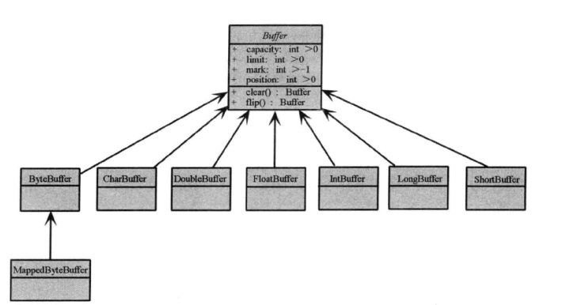
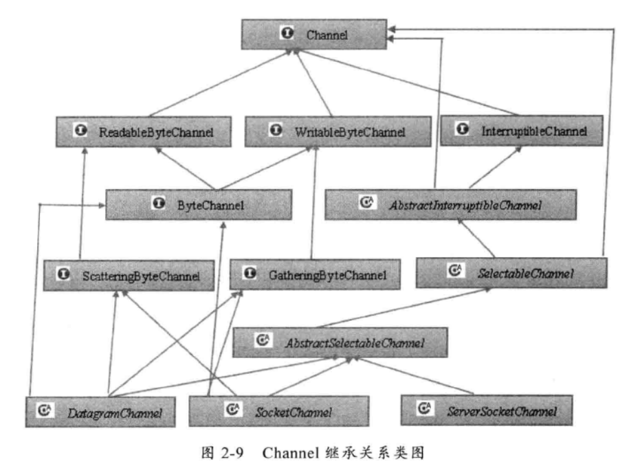
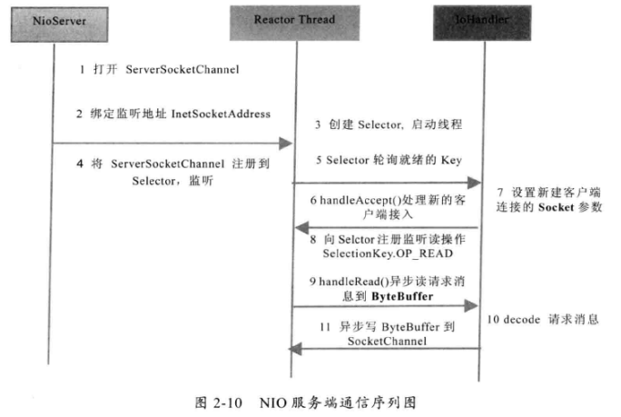
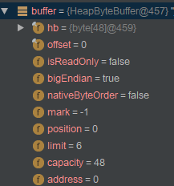
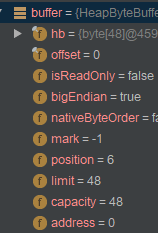

# NIO简介

## 基本概念

NIO：非阻塞IO

NIO提供了与Socket类以及ServerSocket类相对应的SocketChannel和ServerSocketChannel。这两种通道都支持阻塞与非阻塞两种模式。

## NIO类库简介

### 缓冲区Buffer

Buffer是一个包含了要写入或要读出数据的对象。在面向流的IO中可以将数据直接写入或者将数据读到Stream对象中。

在NIO库中，所有数据都用缓冲区处理。读取/写入数据时直接读取/写入到缓冲区，访问NIO数据都是通过缓冲区。

实际上是一个数组（字节数组ByteBuffer），但提供了对数据结构化访问以及维护读写位置（limit）等信息。这些Buffer提供了一组功能用于操作对应的数组，缓冲区类型：

- ByteBuffer：字节缓冲区
- CharBuffer：字符缓冲区
- ShortBuffer：短整型缓冲区
- IntBuffer：整型缓冲区
- LongBuffer：长整型缓冲区
- FloatB...
- DoubleB...

**继承关系图：**

除了ByteBuffer，其他Buffer类操作完全一样。大多数标准IO操作都是用ByteBuffer，所以还有一些特殊的操作以方便网络读写。

### 通道Channel

Channel是全双工的，网络数据通过Channel读取写入，与流不同点在于Channel是双向的，支持读写。而Stream一定是InputStream/OutputStream的子类。

**Channel继承关系如下：**

前三层是一些功能的Channel接口，后面则是一些具体功能。Channel可以分为两大类，用于网络读写的SelectableChannel与用于文件操作的FileChannel。

### 多路复用器Selector

Selector是JavaNIO的基础，提供选择已就绪的任务的能力（会轮询注册在其上的Channel，如果某个Channel发生读/写事件，Channel处于就绪状态会被Selector轮询发现，再通过SelectionKey可以获取就绪Channel集合）

一个Selector可以轮询多个Channel，而且epoll()代替传统select以后，就没有连接句柄1024/2048的限制。只需要一个线程负责轮询，可以接入成千上万客户端。

# NIO服务端序列图

**NIO服务端通信序列图：**

## 服务器端程序步骤

1. 打开ServerSocketChannel，用于监听客户端连接，作为所有客户端连接的父管道
2. 绑定监听端口，设置为非阻塞模式
3. 创建Reactor线程，厨房间多路复用器并启动线程
4. 将ServerSocketChannel注册到Reactor线程的多路复用器Selector上，监听Accept事件
5. Selector在run方法的循环体内轮询准备就绪的key
6. Selector监听到客户端接入，处理新请求，完成TCP三次握手，建立物理链路
7. 设置客户端链路为非阻塞模式
8. 将新接入的客户端连接注册到Reactor线程的多路复用器上，监听读操作，读取客户端发送改动网络信息
9. 异步读取客户端请求到缓冲区
10. 对ByteBuffer做编解码，如果有半包消息指针reset，继续读取后续保温，将解码成功的消息封装成Task，投递到业务线程池中，进行业务逻辑编排。
11. 将POJO对象encode成ByteBuffer，调用SocketChannel的异步write接口将消息异步发送给客户端

注意：如果发送区TCP缓冲区满，会导致写半包，需要注册监听写操作为，循环写，直到整包消息写入TCP缓冲区。

## 一些类

### SelectionKey

作用：表示一个通道与一个选择器的注册关系。一个通道（ServerSocketChannel/SocketChannel）可以被注册到一个选择器上，以便在选择器上进行选择操作。选择器会监控通道，当通道做好准备，选择器就会通知这个通道。

包含的信息：

- channel：这个SelectionKey所关联的通道
- selector：这个SelectionKey所关联的选择器
- interestOps：选择器所关系的通道操作类型，比如读、写、连接
- readyOps：通道当前已经准备就绪的操作类型，比如读、写、连接

可以用SelectionKey的方法来操作这些信息。

### ByteBuffer

#### 简介

用于NIO的缓冲区操作，所有的通道Channel都是将数据写入到Buffer中来操作，而ByteBuffer是Buffer中改动一种，作为字节缓冲区。与此同时，由于ByteBuffer本身适用于网络通信，所以他与其他Buffer结构不太相同.

mark/limit/position/capacity

**初始分配内存：**

#### 方法

- flip()：position回到0，limit变为之前的position
- clear()：清空缓存区回到初始分配状态
- mark()：将mark数值标注到当前position位置
- rewind()：重置mark与position数值
- reset()：将position位置定位到mark。
- hasRemaining()：比较position与limit大小
- get(byte[])：读取数据
- put(byte[])：写入数据
